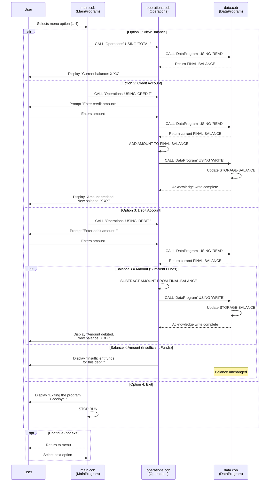

# COBOL Student Account Management System Documentation

## Overview
This is a legacy COBOL-based Account Management System designed to handle student account operations. The system provides a menu-driven interface for viewing account balances, crediting accounts, and debiting accounts with built-in validation for insufficient funds scenarios.

## System Architecture

The system is composed of three interconnected COBOL programs that work together to manage student accounts:

```
Main Program (main.cob)
    ↓ (Menu-driven user interface)
    ↓ (Calls Operations program)
Operations Program (operations.cob)
    ↓ (Calls Data program for persistence)
Data Program (data.cob)
    ↓ (Manages balance storage and retrieval)
```

---

## COBOL Files

### 1. main.cob - MainProgram
**Purpose**: Entry point and user interface for the Account Management System

**Key Functions**:
- Displays a user-friendly menu with four options
- Handles user input validation for menu selection (1-4)
- Implements a loop-based menu system using `PERFORM UNTIL`
- Routes user requests to the Operations program based on selection
- Manages program flow control with the CONTINUE-FLAG

**Menu Options**:
| Option | Operation | Function Call |
|--------|-----------|---------------|
| 1 | View Balance | CALL 'Operations' USING 'TOTAL ' |
| 2 | Credit Account | CALL 'Operations' USING 'CREDIT' |
| 3 | Debit Account | CALL 'Operations' USING 'DEBIT ' |
| 4 | Exit | Program termination |

**Business Rules**:
- Invalid menu selections (not 1-4) display an error message and re-prompt
- Program continues looping until user selects option 4 (Exit)
- System terminates gracefully with farewell message upon exit

**Data Structures**:
```cobol
USER-CHOICE       PIC 9        - Single digit for menu selection
CONTINUE-FLAG     PIC X(3)     - Controls program loop (YES/NO)
```

---

### 2. operations.cob - Operations
**Purpose**: Orchestrates account operations (view, credit, debit) and enforces business logic

**Key Functions**:
- **TOTAL Operation**: Retrieves and displays current account balance
- **CREDIT Operation**: Adds funds to the account
- **DEBIT Operation**: Withdraws funds from the account with validation
- Communicates with the Data program to read/write persistent balance data
- Validates debit transactions against available funds

**Business Rules**:
1. **View Balance (TOTAL)**
   - Reads current balance from persistent storage
   - Displays the balance to the user
   - No validation required

2. **Credit Account (CREDIT)**
   - Prompts user to enter credit amount
   - Retrieves current balance from storage
   - Adds amount to balance
   - Writes updated balance back to storage
   - Displays confirmation with new balance
   - No upper limit restriction

3. **Debit Account (DEBIT)**
   - Prompts user to enter debit amount
   - Retrieves current balance from storage
   - **Critical Business Rule**: Validates that current balance >= debit amount
   - If sufficient funds: subtracts amount, saves balance, displays confirmation
   - If insufficient funds: displays error message and rejects transaction
   - **Security**: Prevents overdraft situations

**Data Structures**:
```cobol
OPERATION-TYPE     PIC X(6)     - Type of operation (READ/WRITE/TOTAL/CREDIT/DEBIT)
AMOUNT             PIC 9(6)V99  - Transaction amount (up to 999,999.99)
FINAL-BALANCE      PIC 9(6)V99  - Current account balance (initial: 1000.00)
```

---

### 3. data.cob - DataProgram
**Purpose**: Manages persistent data storage for student account balances

**Key Functions**:
- **READ Operation**: Retrieves current balance from persistent storage
- **WRITE Operation**: Updates and persists the account balance
- Acts as a data access layer between Operations and storage

**Persistent Data**:
```cobol
STORAGE-BALANCE    PIC 9(6)V99  - Persistent account balance (initial value: 1000.00)
```

**Business Rules**:
- Initial account balance for new students: **1000.00** (currency units)
- Balance is maintained as a numeric value with 2 decimal places (assumes currency with cents)
- All read/write operations are synchronous
- No validation occurs at the data layer (validation handled by Operations program)
- Data persistence is achieved through COBOL working storage (in-memory for this implementation)

**Operations Interface**:
- **READ**: Accepts operation code 'READ' and returns current balance
- **WRITE**: Accepts operation code 'WRITE' and updates balance with new value
- Uses LINKAGE SECTION for inter-program communication

---

## Critical Business Rules Summary

### Account Constraints
- **Initial Balance**: 1000.00
- **Precision**: 2 decimal places (currency format)
- **Maximum Value**: 999,999.99
- **Minimum Value**: 0.00 (cannot have negative balance via debit)

### Transaction Controls
1. **Debit Prevention**: Debits that exceed available balance are rejected
2. **Credit Allowance**: Credits are always allowed (no upper limit)
3. **Balance Retrieval**: Always reflects current state before transaction execution
4. **Atomic Operations**: Each transaction reads → modifies → writes balance

### User Interaction Rules
- Invalid menu selections are re-prompted without penalty
- All currency amounts use decimal notation (e.g., 50.00)
- Operations display confirmation messages with updated balance
- System provides helpful error messages for insufficient funds

---

## Data Flow Example

### Debit Transaction Example
```
User selects option 3 (Debit)
        ↓
Operations prompts for debit amount
        ↓
User enters: 100.00
        ↓
Operations calls DataProgram READ → retrieves current balance (1000.00)
        ↓
Operations validates: 1000.00 >= 100.00 ✓ (sufficient funds)
        ↓
Operations calculates: 1000.00 - 100.00 = 900.00
        ↓
Operations calls DataProgram WRITE → saves new balance (900.00)
        ↓
Operations displays: "Amount debited. New balance: 900.00"
        ↓
User returns to main menu
```

### Insufficient Funds Example
```
User selects option 3 (Debit)
        ↓
Operations prompts for debit amount
        ↓
User enters: 2000.00
        ↓
Operations calls DataProgram READ → retrieves current balance (900.00)
        ↓
Operations validates: 900.00 >= 2000.00 ✗ (insufficient funds)
        ↓
Operations displays: "Insufficient funds for this debit."
        ↓
Balance remains unchanged (900.00)
        ↓
User returns to main menu
```

---

## Technical Notes

- **Language**: COBOL (legacy standard)
- **Communication**: Inter-program calls using `CALL` statement with `USING` parameters
- **Data Type**: Numeric with 2 decimal places for all monetary values
- **Loop Control**: PERFORM UNTIL for menu iteration
- **Conditional Logic**: IF/ELSE-IF structures and EVALUATE for operation routing

---

## Future Modernization Considerations

This legacy system is a candidate for modernization with:
- Migration to modern languages (Python, C#, Java)
- Database integration (SQL Server, PostgreSQL)
- REST API interfaces
- Multi-user concurrency support
- Enhanced audit logging
- Input validation and error handling improvements

---

## Data Flow Sequence Diagram

This diagram illustrates the complete data flow through the system for different transaction types:



---

## Mermaid Diagram Legend

- **Solid arrows (→)**: Synchronous calls and data requests
- **Dashed arrows (→)**: Return values and responses
- **alt blocks**: Different transaction paths (VIEW, CREDIT, DEBIT, EXIT)
- **Decision diamonds**: Validation logic (sufficient funds check)
- **Note blocks**: Important state information (balance unchanged on failed debit)

---
